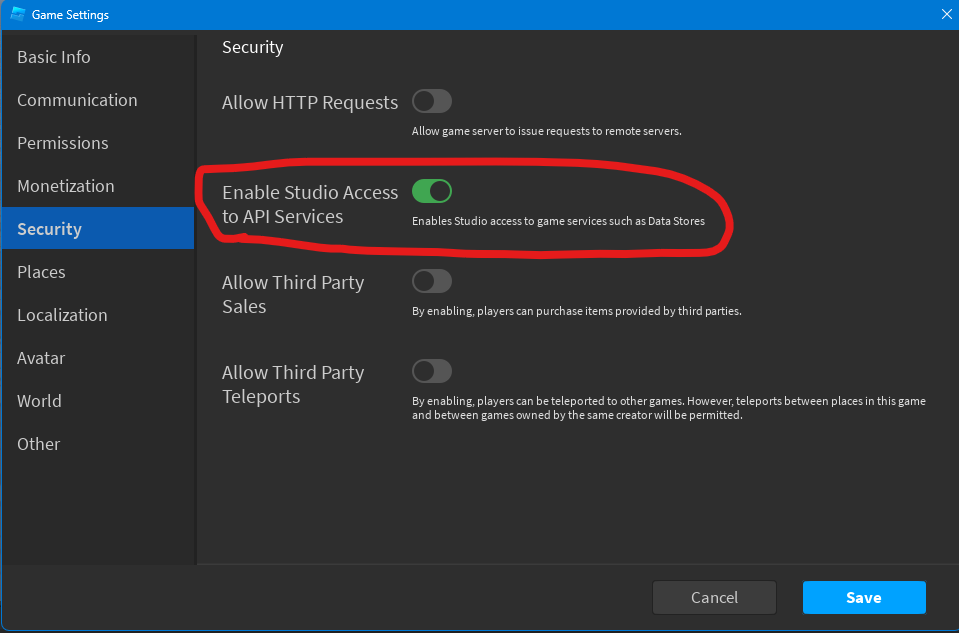

# Settup

To start using this module it is very simple let me show you.
To start you will need to get the module, there are various ways of doing it such as:
 * Putting the source code into your game and then requiring. You can get it here: https://github.com/NameTakenBonk/SuphisDataStoreModule/releases
 ```lua
local ServerStorage = game:GetService("ServerStorage")
local DataStoreModule = require(ServerStorage.DataStoreModule)
 ```
 * Requiring using an id
```lua
local DataStoreModule = require(11671168253)
```
**You must have this setting enbaled!**

